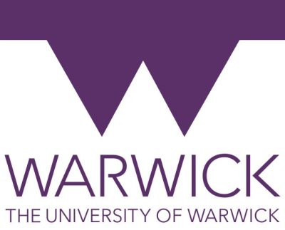

---

layout: col-sidebar
title: OWASP Warwick
tags: Warwick
level: 3
region: Europe
currency: gbp
meetup-group: OWASP-Warwick
country: United Kingdom
postal-code: CV4 7AL

---

OWASP Warwick UK
-------------
Welcome to the Warwick UK Chapter homepage. 
The chapter board is <a href="mailto:miroslaw.malinowski@owasp.org">Mirek Malinowski</a>, <a href="mailto:brian.mcglone@owasp.org">Brian McGlone</a> and <a href="mailto:christo.panchev@owasp.org">Christo Panchev</a>. 
Follow chapter news on [Twitter](https://twitter.com/OWASPWarwickUK) [LinkedIn](https://www.linkedin.com/in/owasp-warwick-972a89300/)

Speaking at OWASP Warwick UK Chapter Events
----------------

#### Call For Speakers

We're always on the look out for speakers, whether from the local area or from anywhere and just in Warwick for business or pleasure -  please review and agree with the [OWASP Speaker Agreement](https://owasp.org/www-policy/) and send the proposed talk title, abstract and speaker bio to the Chapter Leaders via e-mail (See links on the right hand side)

Chapter Supporters
----------------
The following are the list of OWASP Corporate Members who have generously aligned themselves with the Warwick chapter, therefore contributing funds to our chapter:
<table cellpadding="15" cellspacing="0">
<tr>
<td>
    
</td>
</tr>
</table>

Next Meeting/Event(s)
---------------------
[//]: # (Comment: When updating the next event info also update the next event tab)

### Wed, 12 June 2024 18:00 – 21:00 GMT
International Manufacturing Centre Building (WMG)

We're really excited to be holding the first Warwick OWASP Chapter meetup.

We're using Eventbrite solely to gauge figures for attendance - OWASP meetings are always FREE.

#### TALKS
\#1: **Welcome to OWASP Warwick** - Brian McGlone (IBM X-Force Red)

\#2: **Exploiting Weaknesses in AI Systems** - Jakub Partyka (LRQA Nettitude)

\#3: **CHERI - Memory safe architecture - what is it, and do we need one?** - Mirek Malinowski (Cyber Security Reaserch Group - WMG)

OWASP Warwick Chapter meetings are posted on our MeetUp Page:

Please visit  <a href="http://www.meetup.com/OWASP-Warwick">http://www.meetup.com/OWASP-Warwick</a> OWASP Warwick MeetUp site for Warwick Chapter event information.

<!--  -->

**Code of Conduct**:

We hope you enjoy our events, we care deeply about inclusivity and diversity so that OWASP is a comfortable and welcoming community for everyone. Please reach out to one of our chapter leaders if you have any feedback or would like to speak to us, we take these matters very seriously. You can find out more about our policies here: [Click](https://owasp.org/www-policy/)
